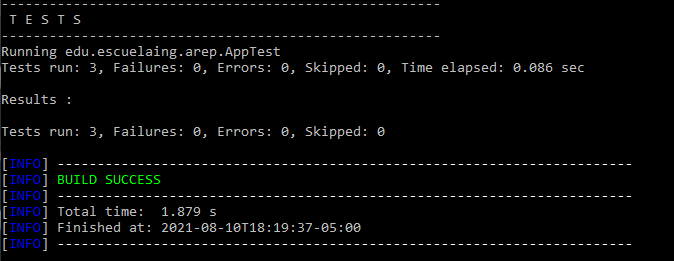

# Taller introducción Mvn-Git

>Taller de repaso de manejo de Maven y GIT, el cual sera un programa para calcular la desviación estándar y media de un conjunto de n números reales, realizando la lectura de los n números reales de un archivo de texto, el cual utilizara una Linkedlist para almacenar los n números para posteriormente los respectivos cálculos. Escribiendo una implementación de una Linkedlist que sea compatible con la API de colecciones de Java.

### Pre-requisitos

> Para  elaborar este proyecto requeimos de dos tecnologias:
> * [Maven](https://es.wikipedia.org/wiki/Maven): Herramienta la cual permite realizar la construción de proyectos, realizarles pruebas y otras funciones.
> * [Git](https://es.wikipedia.org/wiki/Git): Software de control de versionamiento centralizado.


### Instalación

Clonamos este repositario desde cmd, con el siguiente comando

```
git clone https://github.com/RichardUG/Arep-IntroduccionMvnGit.git
```

Realizamos el package del proyecto

```
mvn package
```
## Running the tests

Desde el mismo cmd, realizamos las pruebas unitarias por medio de maven, con el comando

```
mvn test
```
Despues de ejecutarlo saldra este texto, el cual indica que las pruebas que se ejecutaron al interior del programa, fueron ejecutadas de manera exitosa.



## Construido con

* [Maven](https://maven.apache.org/): Herramienta que se encarga de estandarizar la estructura física de los proyectos de software, maneja dependencias (librerías) automáticamente desde repositorios y administra el flujo de vida de construcción de un software.
* [GIT](https://git-scm.com/): Sistema de control de versiones que almacena cambios sobre un archivo o un conjunto de archivos, permite recuperar versiones previas de esos archivos y permite otras cosas como el manejo de ramas (branches).
* [Intelij](https://es.wikipedia.org/wiki/IntelliJ_IDEA): es un entorno de desarrollo integrado (IDE) para el desarrollo de programas informáticos. Es desarrollado por JetBrains, y está disponible en dos ediciones: edición para la comunidad1 y edición comercial.
* [Java](https://www.oracle.com/java/): Lenguaje de programación de propósito general, es decir, que sirve para muchas cosas, para web, servidores, aplicaciones móviles, entre otros. Java también es un lenguaje orientado a objetos, y con un fuerte tipado de variables.

## Autor
[Richard Santiago Urrea Garcia](https://github.com/RichardUG)

## Licencia & Derechos de Autor
**©** Richard Santiago Urrea Garcia, Estudiante de Ingeniería de Sistemas de la Escuela Colombiana de Ingeniería Julio Garavito

Licencia bajo la [GNU General Public License](https://github.com/RichardUG/Arep-IntroduccionMvnGit/blob/main/License).
